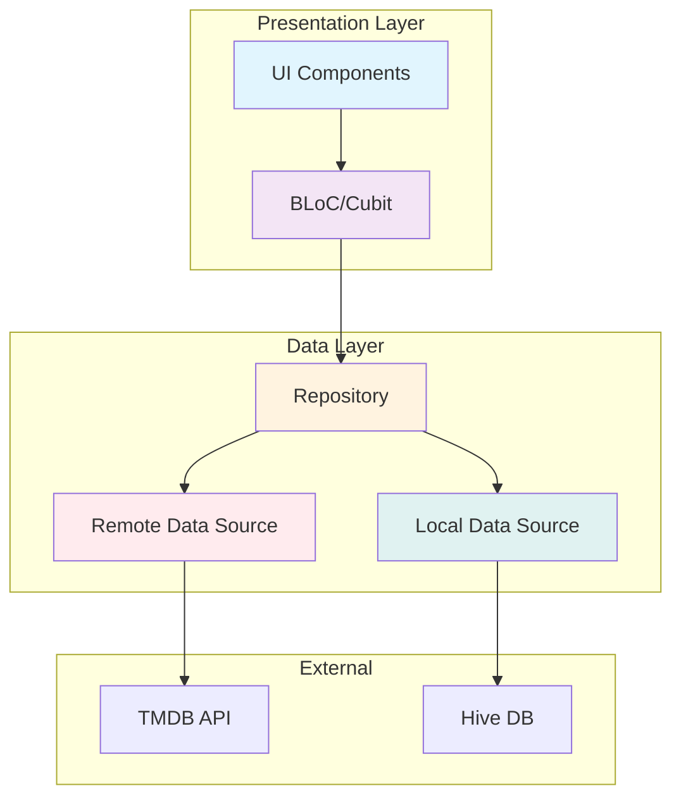
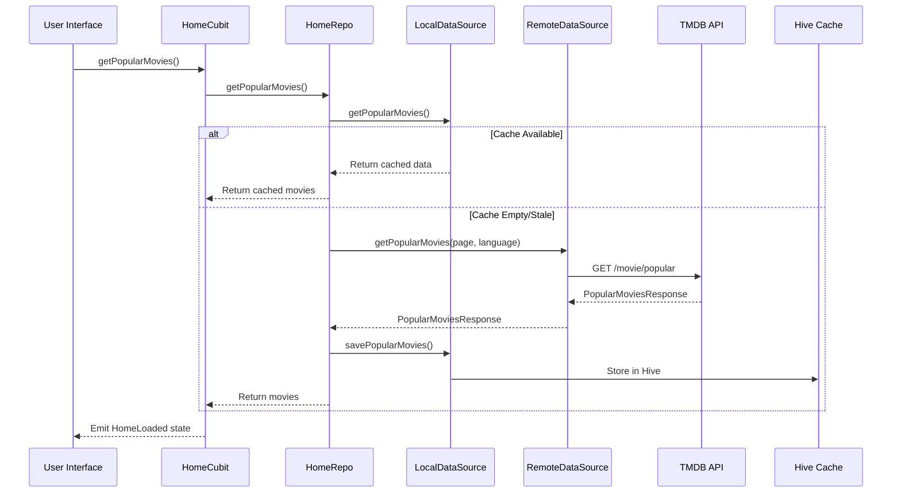
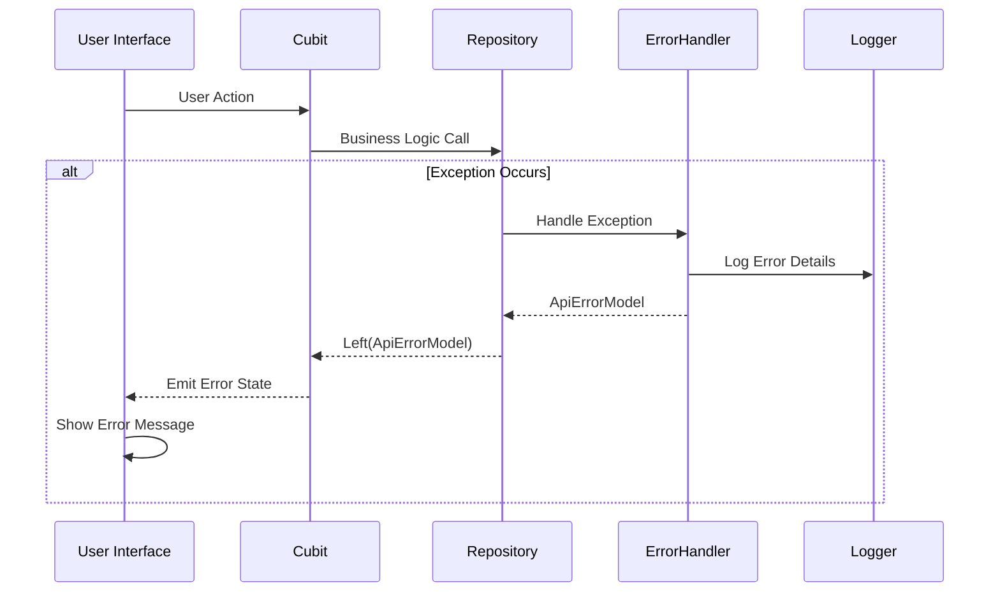

# Movie App 📱

A modern, feature-rich Flutter application for browsing popular movies using The Movie Database (TMDB) API. Built with Clean Architecture principles and state-of-the-art Flutter development practices.

## 🎥 Demo

Watch the app demo: [Movie App Demo](https://drive.google.com/file/d/1Jm7FCTChuMZef7O0PYs0HOnsNVILSiiO/view?usp=sharing)

## 🚀 Features

- **Popular Movies Browsing**: Infinite scroll through TMDB's popular movies
- **Offline Support**: Local caching with Hive for offline movie browsing
- **Dark/Light Theme**: Automatic theme switching with persistent preferences
- **Responsive Design**: Adaptive UI that works across different screen sizes
- **Error Handling**: Comprehensive error handling with user-friendly messages
- **State Persistence**: Hydrated BLoC for maintaining app state across sessions
- **Logging & Monitoring**: Sentry integration for error tracking and custom logging
- **Pull to Refresh**: Easy data refresh functionality
- **Movie Details**: Detailed view for each movie with ratings and overview

## 🏗️ Architecture Overview

This app follows **Layered Architecture** principles with a **Feature-based** structure, ensuring scalability, testability, and maintainability. The architecture focuses on clear separation of concerns between Presentation and Data layers, with repositories acting as the boundary between UI and data access.

### Project Structure

```
lib/
├── core/                          # Shared business logic
│   ├── cache/                     # Caching utilities
│   ├── constants/                 # App constants and API endpoints
│   ├── di/                        # Dependency injection setup
│   ├── errors/                    # Error handling
│   ├── helper/                    # UI helpers
│   ├── logger/                    # Logging utilities
│   ├── network/                   # Network configuration
│   ├── routes/                    # Navigation routes
│   ├── theme/                     # Theme management
│   └── utils/                     # Utility classes
├── feature/                       # Feature-based modules
│   ├── home/                      # Home feature (movie listing)
│   │   ├── data/                  # Data layer
│   │   └── presentation/          # Presentation layer
│   └── details/                   # Movie details feature
├── main.dart                      # App entry point
└── movie_app.dart                 # Root widget
```

### Architecture Layers



## 🗂️ Data Flow Architecture

### Movie Fetching Flow



### Error Handling Flow



## 🔧 Technical Stack

### State Management
- **BLoC Pattern**: Using flutter_bloc for predictable state management
- **Hydrated BLoC**: Persistent state across app restarts
- **Cubits**: Simplified BLoC implementation for straightforward use cases

### Networking & API
- **Dio**: HTTP client with interceptors
- **Retrofit**: Type-safe REST API client code generation
- **Pretty Dio Logger**: Network request/response logging

### Local Storage
- **Hive**: Fast, lightweight NoSQL database
- **Hive Adapters**: Custom type adapters for complex objects
- **Shared Preferences**: Simple key-value storage

### Dependency Injection
- **GetIt**: Service locator for dependency injection
- **Lazy Singletons**: Efficient resource management

### UI & Theming
- **Flutter ScreenUtil**: Responsive design adaptation
- **Material Design 3**: Modern UI components
- **Custom Theme System**: Light/Dark theme support with extensions

### Error Monitoring
- **Sentry Flutter**: Real-time error tracking and monitoring
- **Custom Error Handler**: User-friendly error messages
- **Comprehensive Logging**: AppLogger for development insights

## 📦 Dependencies

### Core Dependencies
```yaml
dependencies:
  flutter_bloc: ^9.1.1          # State management
  dio: ^5.9.0                   # HTTP client
  retrofit: ^4.8.0              # REST API client
  hive: ^2.2.3                  # Local database
  hydrated_bloc: ^10.1.1        # Persistent state
  get_it: ^8.2.0                # Dependency injection
  sentry_flutter: ^9.7.0        # Error monitoring
```

### Development Dependencies
```yaml
dev_dependencies:
  build_runner: null            # Code generation
  hive_generator: ^2.0.1        # Hive adapters
  retrofit_generator: null      # API client generation
  json_serializable: null       # JSON serialization
```

## 🚀 Getting Started

### Prerequisites
- Flutter SDK (^3.9.2)
- Dart SDK (^3.9.2)
- TMDB API Key

### Installation

1. **Clone the repository**
   ```bash
   git clone https://github.com/your-username/movie-app.git
   cd movie-app
   ```

2. **Install dependencies**
   ```bash
   flutter pub get
   ```

3. **Setup environment variables**
   - Copy the `env` file to `env/.env`
   - Add your TMDB API token:
     ```
     API_TOKEN=your_tmdb_api_token_here
     ```

4. **Generate code**
   ```bash
   flutter pub run build_runner build
   ```

5. **Run the app**
   ```bash
   flutter run
   ```

## 🔐 Environment Configuration

The app uses environment variables for sensitive configuration:

- `API_TOKEN`: TMDB API Bearer token
- Base URL and timeouts are configured in `api_constants.dart`

## 🎯 Key Components

### Core Classes

#### HomeCubit
Manages the state of the home screen with pagination support:
- `getPopularMovies()`: Initial data loading
- `loadMoreMovies()`: Infinite scroll pagination
- `refreshMovies()`: Pull-to-refresh functionality

#### HomeRepository
Implements the repository pattern with cache-first strategy:
- Checks local cache before making API calls
- Saves API responses to local storage
- Handles both remote and local data sources

#### DioFactory
Configures the Dio HTTP client with:
- Base URL and timeouts
- Authorization headers
- Request/response logging
- Error interceptors

### Data Models

#### MovieModel
Represents a movie entity with:
- Basic movie information (title, overview, ratings)
- Image paths for posters and backdrops
- Release dates and language information

#### PopularMoviesResponseModel
API response wrapper containing:
- List of movies
- Pagination metadata (page, total pages, total results)

## 🔄 App Flow

1. **App Launch**: Initialize Hive, HydratedBloc, and dependency injection
2. **Home Screen**: Load popular movies from cache or API
3. **Infinite Scroll**: Load more movies as user scrolls
4. **Movie Details**: Navigate to detailed view on movie tap
5. **Theme Toggle**: Switch between light/dark themes
6. **Pull Refresh**: Refresh movie data on demand

## 🧪 Testing Strategy

- **Unit Tests**: Core business logic and utilities
- **Widget Tests**: UI components and state management
- **Integration Tests**: End-to-end user flows

## 📱 Supported Platforms

- **Android**: API 21+ (Android 5.0+)
- **iOS**: iOS 11.0+
- **Web**: Modern web browsers
- **Windows**: Windows 10+
- **macOS**: macOS 10.14+
- **Linux**: Ubuntu 18.04+

## 🤝 Contributing

1. Fork the repository
2. Create a feature branch (`git checkout -b feature/amazing-feature`)
3. Commit your changes (`git commit -m 'Add amazing feature'`)
4. Push to the branch (`git push origin feature/amazing-feature`)
5. Open a Pull Request

## 📄 License

This project is licensed under the MIT License - see the [LICENSE](LICENSE) file for details.

## 🙏 Acknowledgments

- [The Movie Database (TMDB)](https://www.themoviedb.org/) for providing the movie data API
- Flutter community for excellent documentation and packages
- All contributors and maintainers

---

**Built with ❤️ using Flutter**